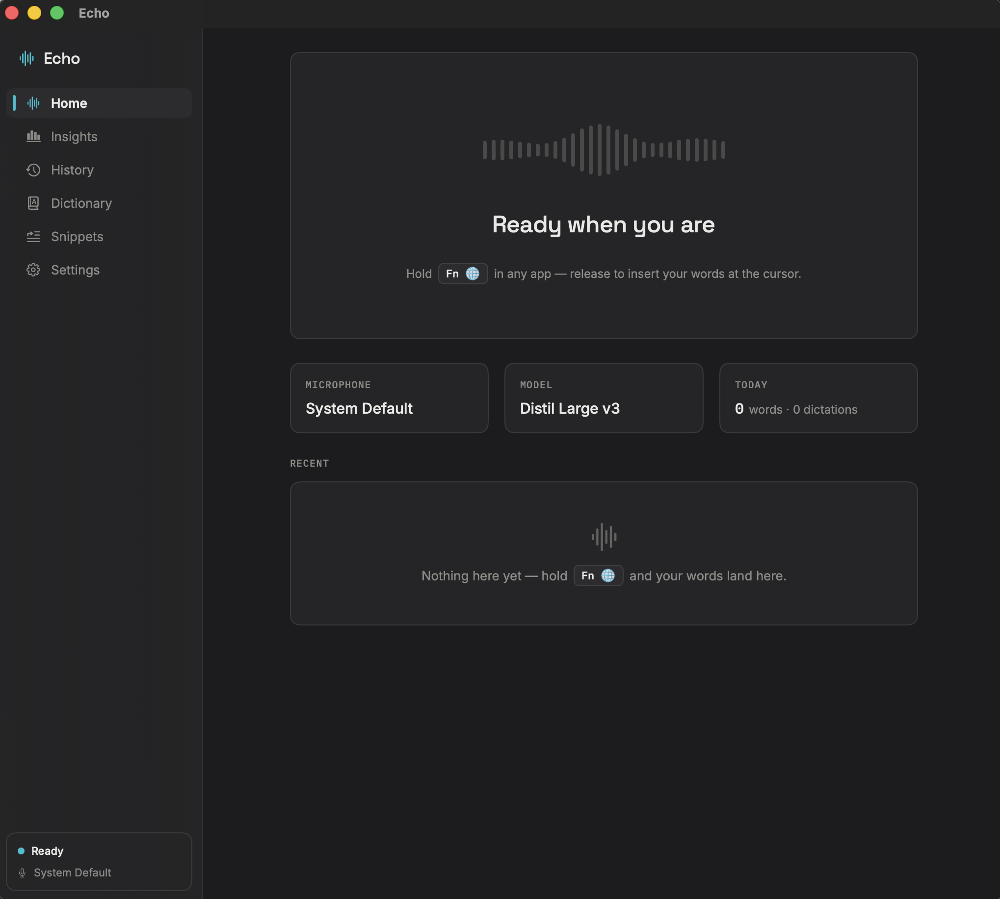
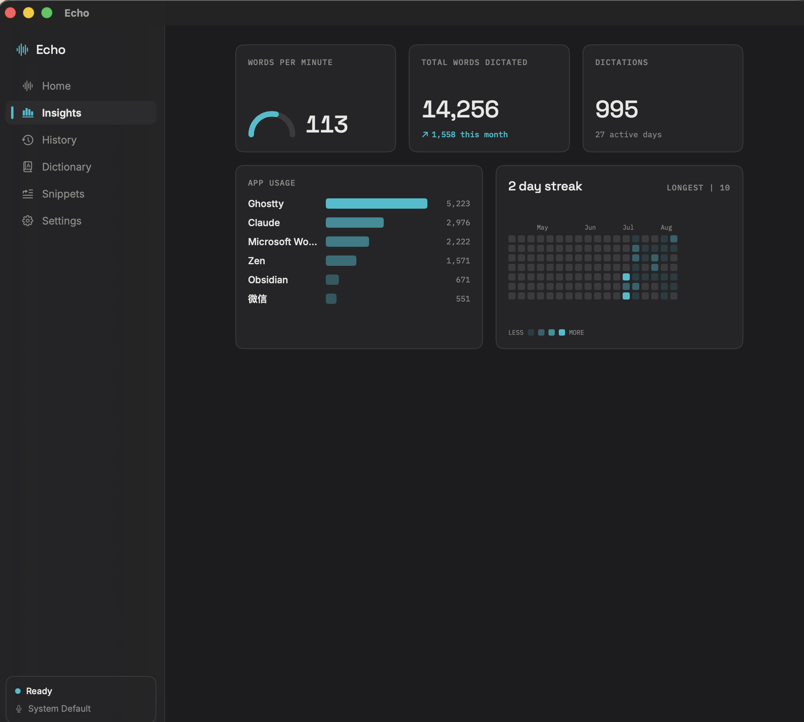

# Echo: Local Dictation for macOS

Echo is my daily driver for voice input while building software. It is a macOS app that records while I hold a global hotkey, transcribes the audio locally, processes the result, and inserts it at the current cursor.

The default workflow is:

1. Hold Right Option.
2. Speak.
3. Release the key.
4. Echo inserts the transcript into the focused app.

No account or transcription API is required. Model downloads require a network connection, but inference runs on the Mac.



## Architecture

```text
Global hotkey
    -> AVAudioEngine capture (16 kHz mono Float32)
    -> voice activity trimming
    -> WhisperKit + Core ML
    -> text processing
    -> clipboard paste at the focused cursor
```

Echo is written in Swift with SwiftUI and AppKit. `DictationController` coordinates capture, transcription, processing, insertion, history, and usage tracking.

Audio capture uses `AVAudioEngine`. Captured buffers are converted to 16 kHz mono samples. A voice activity trimmer removes leading and trailing non-speech audio before transcription. The recorder keeps the audio engine warm briefly after each dictation to reduce Bluetooth microphone startup failures.

Transcription uses WhisperKit with Core ML. The default model is Distil Large v3 at 594 MB. Echo also supports Tiny, Base, Small, Large v3 Turbo, and Large v3. Models are prewarmed after loading so the first dictation does not pay the full initialization cost.

## Text insertion

Direct Accessibility API insertion is inconsistent across native apps, Electron apps, and browsers. Echo uses clipboard paste instead:

1. Snapshot the current clipboard.
2. Write the transcript to the clipboard.
3. Synthesize Command-V.
4. Restore the previous clipboard contents after the target app handles the paste.

Echo checks the focused Accessibility element before insertion. Secure input and known non-editable controls use a copy fallback instead of an automatic paste. The fallback appears in the floating overlay for manual copying.

Microphone access is required for recording. Accessibility access is required for the global workflow and cursor insertion.

## Processing

The processing pipeline is deterministic:

1. Collapse excess whitespace.
2. Apply dictionary replacements.
3. Expand snippets.

The dictionary has two functions. It supplies vocabulary to Whisper as prompt context, and it replaces recurring recognition errors after transcription. Matching is case-insensitive and limited to whole words.

Snippets map spoken trigger phrases to saved text. They work as standalone utterances or inside a longer sentence. Expansions are inserted verbatim, which makes them useful for email addresses, links, commands, and repeated prompts.

## Local data

Transcript history is optional and stored locally as JSON. It is capped at 500 entries.

Usage statistics are stored separately in SQLite. The database stores counts, timings, outcomes, model identifiers, and target app metadata. It does not store transcript text. The Insights view calculates:

- words per minute
- total dictated words
- dictation count
- active days and streaks
- words by application
- per-stage latency metrics



The screenshot shows 14,256 dictated words across 995 dictations. Most usage is in Ghostty, Claude, Microsoft Word, Zen, Obsidian, and WeChat. This reflects the main requirement: the same input path must work across terminals, coding tools, browsers, and native applications.

## Reliability work

The main engineering work is around the boundaries of the transcription model:

- waking dormant Bluetooth microphone links
- rejecting captures with no usable audio
- limiting recordings to 120 seconds
- trimming silence before inference
- prewarming the model and inference pipeline
- caching compiled dictionary and snippet rules
- moving history persistence off the main actor
- coalescing waveform updates
- measuring capture, trimming, transcription, processing, insertion, and total latency

These changes reduce delay after releasing the hotkey and prevent UI work from blocking the critical path.

## Stack

- Swift 5.9
- SwiftUI and AppKit
- AVFoundation
- Accessibility APIs
- WhisperKit and Core ML
- SQLite3
- XcodeGen
- XCTest

## Constraints

- Apple Silicon only
- macOS 14 or later
- English transcription configuration
- one-time model download
- microphone and Accessibility permissions
- unsigned and not notarized prebuilt releases

Echo is MIT licensed. Source and builds are available at [github.com/michaelmjhhhh/Echos](https://github.com/michaelmjhhhh/Echos).
